JIGチュートリアル
============================================================

[JIG](https://github.com/dddjava/jig) を使用した開発のチュートリアルです。
以下の順番で進めます。

1. プロジェクトの準備
1. JIGの導入
1. ビジネスルールの開発
1. アプリケーションの開発
1. 他のJIGドキュメントからのフィードバック

🏷 は本リポジトリのGitのTagです。
やっていることがわからない場合などに使用してください。

## プロジェクトの準備

開発するアプリケーションのプロジェクトを作成します。今回のアプリケーションでは以下を使用します。

- JDK 11
- Spring Boot 2.2.2.RELEASE
- Gradle 6.0.1

### Javaプロジェクトの準備

> このセクションは一般的なJavaプロジェクトの作成です。
> Gradleでビルドできるなら、どのような方法で作成しても構いません。

GradleのBuild Init Pluginを使用してプロジェクトを作成します。

```bash
$ gradle init --type java-library \
    --test-framework junit-jupiter \
    --dsl groovy \
    --project-name jig-tutorial \
    --package jig.tutorial
```

`build` を実行して `BUILD SUCCESSFUL` となればOKです。

```bash
$ ./gradlew build

BUILD SUCCESSFUL in 5s
4 actionable tasks: 4 executed
```

🏷 `example/201912-1`

## JIGの導入

[JIG Gradle Plugin](https://github.com/dddjava/jig/tree/master/jig-gradle-plugin) を導入します。

```groovy
plugins {
    id "org.dddjava.jig-gradle-plugin" version "2019.12.1"
}
```

JIGドキュメント時にコンパイルするように設定します。

```groovy
classes.dependsOn(clean)
jigReports.dependsOn(classes)
```

`jigReports` を実行して `BUILD SUCCESSFUL` となればOKです。

```bash
$ ./gradlew jigReports

> Task :jigReports
skipped ...

BUILD SUCCESSFUL in 11s
1 actionable task: 1 executed
```

🏷 `example/201912-2`

### 追加の確認

JIGはダイアグラム出力に[Graphviz](https://www.graphviz.org/)を使用しています。
インストールされていることを確認してください。

```bash
$ dot -V
dot - graphviz version 2.43.0 (0)
```

## JIGドキュメントの紹介

JIGドキュメントには以下があります。

- ビジネスルールドキュメント
    - BusinessRuleList
    - PackageRelationDiagram
    - BusinessRuleRelationDiagram
    - CategoryDiagram
    - CategoryUsageDiagram
- アプリケーションドキュメント
    - ApplicationList
    - BranchList
    - ServiceMethodCallHierarchyDiagram
    - BooleanServiceDiagram
- アーキテクチャドキュメント
    - ArchitectureDiagram
    - PackageTreeDiagram

これらを使用して開発をすすめます。

## ビジネスルールの開発

ビジネスルールを開発してみましょう。
チュートリアルでは「商品の注文を受けて出荷する」を扱います。

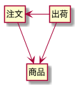

### はじめてのJIGドキュメント
はじめに `jig.tutorial.domain.model.product` パッケージに商品クラスを作成します。
中身は空で構いません。

```java
package jig.tutorial.domain.model.product;

public class Product {
}
```

作成できたら `jigReports` を実行します。
`./build/jig` に `business-rule-relation.svg` が出力されます。

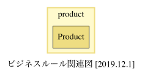

🏷 `example/201912-3`

### クラスの関連で開発する
商品としての関心ごとを挙げ、全てに対するクラスを作成していきます。
ここでは商品名と価格を持つとします。

先ほどと同様に`Name`クラスと`Price`クラスを作成します。


商品名と価格は商品が使用するので、`Product`のフィールドに追加します。

```java
public class Product {
    ProductName productName;
    Price price;
}
```

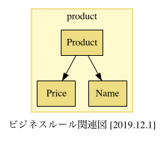

🏷 `example/201912-4`

Javadocコメントに日本語名を記述します。

```java
/**
 * 商品
 */
public class Product {
```

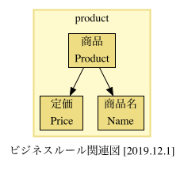

🏷 `example/201912-5`

### パッケージの関連で開発する
次に注文と出荷を開発します。
商品と同様にパッケージとクラスを作成します。

- 注文: `jig.tutorial.domain.model.order`
- 出荷: `jig.tutorial.domain.model.shipment`

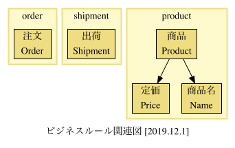

注文は商品、出荷は注文と商品を扱います。それぞれフィールドに追加します。

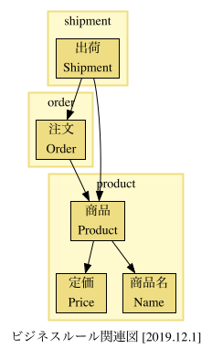

パッケージ間の関連ができると `package-relation-depth*.svg` が出力されます。
和名は `package-info.java` のJavadocで記述できます。

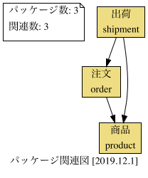

🏷 `example/201912-6`

### 区分で開発する
取り扱うステータスを `enum` で列挙します。

- 商品在庫: 在庫あり、在庫なし
- 注文ステータス: 注文受付済み、出荷済み、キャンセル

`enum` は `category.png` に出力されます。

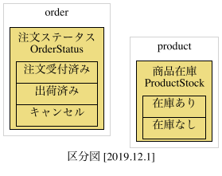

商品在庫を商品のメソッドで返します。

```java
public class Product {
    ...

    public ProductStock productStock() {
        return ProductStock.在庫あり;
    }
```

使用が `category-usage.png` に出力されます。

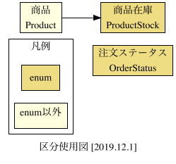

🏷 `example/201912-7`

ここまでの設計は `business-rule.xlsx` で一覧できます。

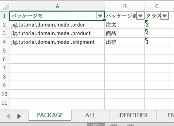

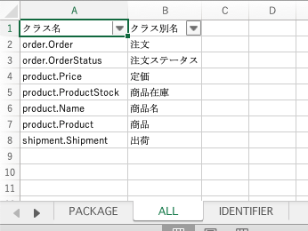

### パッケージを相互依存させてみる
相互依存があると赤矢印が出力されます。

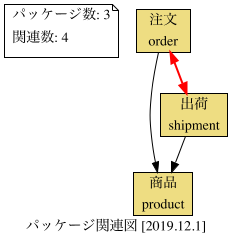

相互依存の原因となっているクラスは `bidirectionalRelations-depth*.txt` に出力されます。

### パッケージをネストさせてみる
パッケージをネストするとパッケージの深さごとにパッケージ関連図が出力されます。

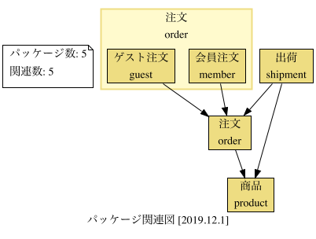

### 💪 チャレンジ

ビジネスルールを自由に開発してみましょう。

#### 使用例: 言葉ファーストでの開発
ドメインの言葉でクラスを作成してJavadocに日本語名を書いていきます。

関連すると思われるクラスをフィールドやメソッドなどで使用しながらラフに関連を設計します。
このアプローチでは処理は二の次で構いません。

ある程度関連が設計できたら処理を記述していきます。
想定外の依存が発生するなどぎこちなくなるとJIGドキュメントからフィードバックが得られます。

## アプリケーションの開発
アプリケーションを開発してみましょう。
このチュートリアルではSpringBootを使用します。

### Spring Bootの導入

> 最低限 `spring-context` さえあれば開発は可能です。

`spring-boot-starter-web` を依存関係に追加します。

```groovy
dependencies {
    implementation platform('org.springframework.boot:spring-boot-dependencies:2.2.2.RELEASE')
    implementation("org.springframework.boot:spring-boot-starter-web")
}
```
``
### アプリケーションを開発する
`@Controller`, `@Service`, `@Repository` を付与したクラスを作成します。

- `jig.tutorial.presentation.controller.SampleController`
- `jig.tutorial.application.service.SampleService`
- `jig.tutorial.application.repository.SampleRepository`
- `jig.tutorial.infrastructure.datasource.SampleDataSource`

クラスを作成したら商品を取得するメソッドを作成します。

🏷 `example/201912-8`

Javadocを記述します。
JIGが扱うものは以下になります。

- `Controller` のクラス名
- `Service` のクラス名、メソッド名
- `Repository` のクラス名

サービスのメソッド呼び出しが `service-method-call-hierarchey.svg` に出力されます。

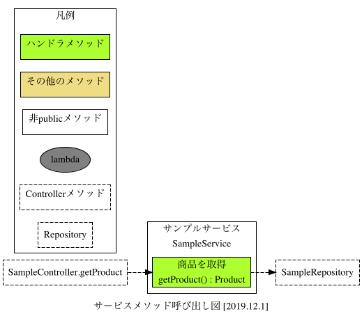

ここまでの設計は `application.xlsx` で一覧できます。

🏷 `example/201912-9`

### 💪 チャレンジ

アプリケーションを自由に開発してみましょう。
必要に応じてビジネスルールを充実させていきましょう。

## 他のJIGドキュメントからのフィードバック

ArchitectureDiagram `architecture.svg` には、アーキテクチャブロックの関連が出力されます。
`domain`から他への依存のような、意図しない依存が発生していないかの確認に役立ててください。

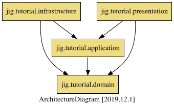

BooleanServiceDiagram は真偽値を返すサービスを作成した場合に出力されます。
サービスが真偽値を返すと、呼び出し元で機械的な判定を行う必要があります。

BranchList `branches.xlsx` はアプリケーションの各メソッドの分岐数です。
分岐はビジネスルールの可能性があります。
ビジネスルールであればアプリケーションからビジネスルールに移動し、ドメインモデル貧血症を予防しましょう。

## 付録: JIGを使用した開発サイクル

JIGでの開発は以下のようになります。

- 頭の中やホワイトボードなどで描く
- コードで書いてみる
-  JIGドキュメントを眺める
- フィードバックを得ながら考える
- コードで書いてみる
- JIGドキュメントを眺める
- ...（以下ループ）

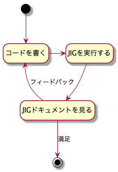

## 付録: JIGを使用しているリポジトリ

- [isolating-the-domain](https://github.com/system-sekkei/isolating-the-domain)
- [JR運賃計算](https://github.com/masuda220/jr-pricing)
- [割り勘](https://github.com/j5ik2o/warikan-domain)

